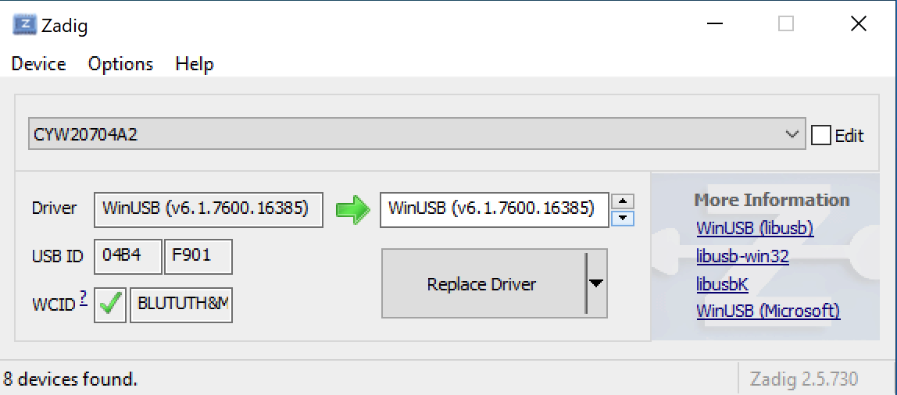
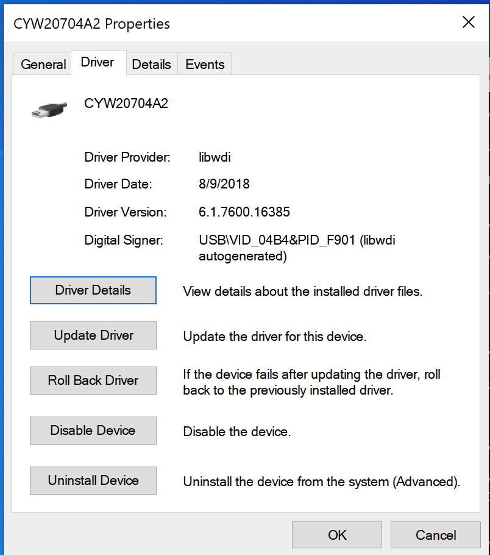

# BTstack Port for Windows Systems using the WinUSB Driver

The Windows-WinUSB port uses the native run loop and WinUSB API to access a USB Bluetooth dongle.

The port provides both a regular Makefile as well as a CMake build file. It uses native Win32 APIs for file access and does not require the Cygwin or mingw64 build/runtine. All examples can also be build with Visual Studio 2022 (e.g. Community Edition).

## Access to Bluetooth USB Dongle with Zadig

To allow WinUSB to access an USB Bluetooth dongle, you need to install a special device driver to make it accessible to user space processes. 

It works like this:

-  Download [Zadig](http://zadig.akeo.ie)
-  Start Zadig
-  Select Options -> “List all devices”
-  Select USB Bluetooth dongle in the big pull down list
-  Select WinUSB in the right pull down list
-  Select “Replace Driver”

After the new driver was installed, your device is shown in the Device Manager with Device Provider 'libwdi'

## Visual Studio 2022

Visual Studio can directly open the provided `port/windows-winusb/CMakeLists.txt` and allows to compile and run all examples.
For this, the C++ CMake tools for Windows is required. They are part of the Desktop development with C++ workloads.

## mingw64 

It can also be compiles with a regular Unix-style toolchain like [mingw-w64](https://www.mingw-w64.org).
mingw64-w64 is based on [MinGW](https://en.wikipedia.org/wiki/MinGW), which '...provides a complete Open Source programming tool set which is suitable for the development of native MS-Windows applications, and which do not depend on any 3rd-party C-Runtime DLLs.'

In the MSYS2 shell, you can install everything with pacman:

    $ pacman -S git
    $ pacman -S cmake
    $ pacman -S make
    $ pacman -S mingw-w64-x86_64-toolchain
    $ pacman -S mingw-w64-x86_64-portaudio
    $ pacman -S python
    $ pacman -S winpty

### Compilation with CMake

With mingw64-w64 installed, just go to the port/windows-h4 directory and use CMake as usual

    $ cd port/windows-h4
    $ mkdir build
    $ cd build
    $ cmake ..
    $ make

Note: When compiling with msys2-32 bit and/or the 32-bit toolchain, compilation fails
as `conio.h` seems to be mission. Please use msys2-64 bit with the 64-bit toolchain for now.

## Console Output

When running the examples in the MSYS2 shell, the console input (via btstack_stdin_support) doesn't work. It works in the older MSYS and also the regular CMD.exe environment. Another option is to install WinPTY and then start the example via WinPTY like this:

    $ winpty ./spp_and_le_counter.exe

